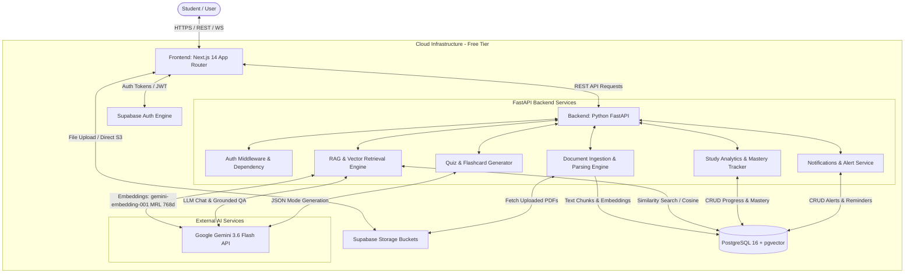
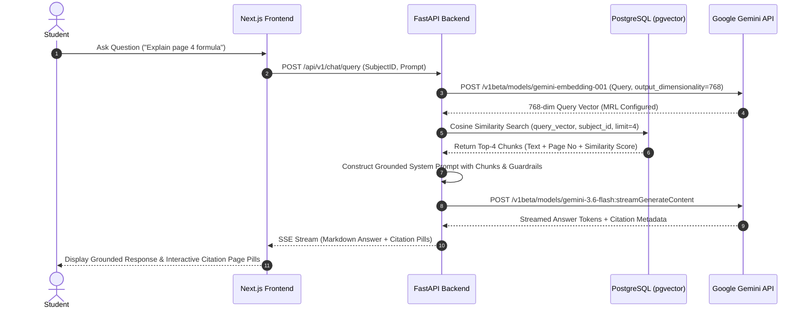

# DOCUMENT 02 — System Architecture & Technical Design

## 1. Architecture Overview
**AI Study Buddy** follows a modern, decoupled client-server architecture. The system comprises a Next.js single-page application frontend, an asynchronous Python FastAPI backend, a PostgreSQL relational database with the `pgvector` extension for vector search, Supabase Auth and Storage services, and Google's Gemini 3.6 Flash API for LLM inference and vector embedding generation.

---

## 2. Architecture Principles
1. **Zero-Cost & Free-Tier Operational Guarantee:** System components are selected to operate 100% within free tiers ($0/month operational cost).
2. **Strict Requirement Traceability:** Every software component directly maps to requirement IDs (`FR-*`, `NFR-*`, `AI-*`).
3. **Decoupled Architecture:** Clean separation between Frontend UI, Backend API services, and AI/ML processing services.
4. **Resilient Rate-Limit Shielding:** In-memory and database response caching to prevent API rate limit exhaustion during hackathon demonstrations.
5. **Context Grounding First:** RAG retrieval pipeline takes precedence over parametric LLM knowledge for document-related queries.

---

## 3. High-Level Architecture Diagram (Mermaid)



---

## 4. System Components & Traceability

| Component Name | Description | Implemented Requirements |
|---|---|---|
| **Next.js Web Client** | React 18 UI with Tailwind CSS, Lucide icons, and Shadcn components. | `FR-01`–`FR-16`, `NFR-07` |
| **FastAPI Backend Gateway** | Async Python HTTP server handling routing, validation, and middleware. | `FR-01`–`FR-16`, `NFR-01`, `NFR-02` |
| **Document Processing Pipeline** | PDF text extractor (`pdfplumber`) + Recursive character chunker. | `FR-03`, `FR-04`, `AI-01` |
| **RAG Retrieval Engine** | Top-k cosine vector search over `document_chunks` using `pgvector`. | `FR-05`, `AI-02`, `AI-03` |
| **Assessment & Study Generator** | Prompt engine producing structured JSON for MCQs, cards, and schedules. | `FR-06`–`FR-09`, `AI-04`–`AI-07` |
| **Analytics & Mastery Engine** | Moving-average scoring engine mapping quiz performance to topic mastery. | `FR-10`–`FR-12`, `AI-08` |
| **Notification Service** | In-app alert dispatching and read/unread status management. | `FR-16` |
| **PostgreSQL + pgvector DB** | Primary relational database storing users, courses, materials, vectors, notifications. | `FR-01`–`FR-16`, `NFR-06`, `NFR-08` |
| **Supabase Auth & Storage** | JWT authentication engine and secure PDF object storage bucket. | `FR-01`, `FR-03`, `NFR-06`, `NFR-08` |

---

## 5. Frontend Architecture
- **Framework:** Next.js 14 (App Router, TypeScript).
- **State Management:** React Context API + `zustand` for chat, document selection, and notification state.
- **Styling & UI:** Tailwind CSS + Lucide React Icons + Radix UI primitives.
- **HTTP Client:** `axios` with interceptors for attaching Supabase JWT Bearer headers.
- **Routing Structure:**
  - `/login`, `/register` — Authentication pages (`FR-01`).
  - `/dashboard` — Main overview hub with widgets (`FR-15`).
  - `/subjects` — Subject and document management (`FR-02`, `FR-03`).
  - `/tutor` — Interactive RAG Chatbot UI (`FR-05`, `FR-13`).
  - `/quizzes` — Quiz generation and test interface (`FR-07`).
  - `/flashcards` — Digital flashcard review deck (`FR-08`).
  - `/planner` — Adaptive study schedule calendar (`FR-09`).
  - `/notifications` — User alerts and reminder center (`FR-16`).

---

## 6. Backend Architecture
- **Framework:** Python 3.11+ with FastAPI.
- **ORM & Validation:** SQLAlchemy 2.0 (Async engine) + Pydantic v2 schemas.
- **API Structure:**
  - `app/api/v1/endpoints/auth.py` — Auth verification (`FR-01`).
  - `app/api/v1/endpoints/subjects.py` — Subject/Course management (`FR-02`).
  - `app/api/v1/endpoints/documents.py` — Material ingestion & status (`FR-03`, `FR-04`).
  - `app/api/v1/endpoints/chat.py` — RAG Q&A streaming (`FR-05`, `AI-03`).
  - `app/api/v1/endpoints/quizzes.py` — Quiz generation & submission (`FR-07`, `AI-04`).
  - `app/api/v1/endpoints/flashcards.py` — Flashcard generation (`FR-08`, `AI-05`).
  - `app/api/v1/endpoints/planner.py` — Study schedule engine (`FR-09`, `AI-07`).
  - `app/api/v1/endpoints/analytics.py` — Progress & mastery tracking (`FR-10`, `FR-11`, `FR-12`, `AI-08`).
  - `app/api/v1/endpoints/notifications.py` — Study reminders & alerts (`FR-16`).

---

## 7. AI/ML Layer & RAG Architecture



---

## 8. Document Ingestion Processing Pipeline (`AI-01`, `AI-02`)

```mermaid
flowchart LR
    A[Upload PDF] --> B[Supabase Storage Bucket]
    B --> C[FastAPI Background Task]
    C --> D[Extract Text per Page via pdfplumber]
    D --> E[Recursive Character Text Splitter<br/>Chunk Size: 500 | Overlap: 50]
    E --> F[Batch Embedding Request<br/>gemini-embedding-001 output_dimensionality=768]
    F --> G[Store Chunks & 768-dim Vectors<br/>in PostgreSQL document_chunks]
    G --> H[Update Document Status to COMPLETED]
```

---

## 9–14. Infrastructure, Databases & Security
- **Relational Database:** PostgreSQL 16 on Supabase Free Tier.
- **Vector Database:** `pgvector` extension operating natively inside PostgreSQL (HNSW index on vector column using cosine distance `<=>`).
- **File Storage:** Supabase Storage (`study-materials` bucket, private policies, 15MB limit).
- **Authentication:** Supabase Auth issuing JWT tokens verified statelessly by FastAPI backend using RSA public key verification.
- **Security:** Row Level Security (RLS) policies on database tables; strict input sanitization against prompt injection.

---

## 15–18. Caching, Logging & Monitoring
- **Response Cache:** In-memory FastAPI TTL dictionary cache storing frequent RAG query hashes and generated quiz responses (`NFR-04` rate limit protection).
- **Logging:** Structured JSON logging with Python `structlog` capturing request execution times, RAG retrieval scores, and error traces.
- **Monitoring:** Health check endpoint (`GET /health`) and basic log aggregation.

---

## 19–28. Data & User Flows

### Document Upload & Processing Flow (`FR-03`, `FR-04`, `AI-01`, `AI-02`)
1. User selects Subject and drops PDF in Next.js UI.
2. Frontend requests signed upload URL from Supabase Storage -> Uploads PDF directly.
3. Frontend triggers `POST /api/v1/documents/process` with file URL.
4. FastAPI spawns BackgroundTask -> Extracts text -> Chunks (500 chars) -> Embeds via `gemini-embedding-001` (configured with `output_dimensionality=768`) -> Saves to `document_chunks`.
5. Document status set to `COMPLETED`; frontend polling displays success badge.

### Quiz Generation & Mastery Update Flow (`FR-07`, `AI-04`, `FR-11`)
1. User clicks "Generate Quiz" for Subject X.
2. FastAPI retrieves relevant document chunks -> Builds System Prompt with strict Pydantic JSON schema.
3. Calls Gemini 3.6 Flash in `response_mime_type="application/json"`.
4. Saves quiz & questions to database -> Returns quiz payload to UI.
5. User submits answers -> FastAPI scores quiz -> Updates `topic_mastery` moving average (`mastery_score = 0.7 * previous + 0.3 * quiz_score`).

---

## 29–30. Error Handling & Scalability
- **Rate Limit Fallback:** If Gemini API returns HTTP 429, retry with exponential backoff (1s, 2s, 4s); if exhausted, return gracefully cached summary or user notice.
- **Database Connection Pooling:** SQLAlchemy async pool configured with `pool_size=10`, `max_overflow=20` to prevent Supabase connection exhaustion.

---

## 31–32. Technology Selection & Trade-Off Matrix

| Technology Choice | Selected Option | Alternative Considered | Justification for Selection |
|---|---|---|---|
| **LLM Provider** | **Google Gemini 3.6 Flash** | OpenAI GPT-4o-mini | Gemini 3.6 Flash offers generous free-tier limits (15 RPM / 1M TPM / 1500 RPD), 1M context window, and sub-2s latency. |
| **Embedding Model** | **Google gemini-embedding-001** | sentence-transformers/all-MiniLM-L6-v2 | Official Gemini Developer API embedding model configured via MRL to output 768-dim vectors. |
| **Vector Storage** | **pgvector (PostgreSQL)** | Pinecone / Qdrant | Keeps DB architecture unified in a single PostgreSQL instance ($0 extra cost, simplified ACID transactions). |
| **Frontend Framework**| **Next.js 14 App Router** | React SPA (Vite) | Offers SSR for dashboard landing pages, server actions, and seamless Vercel deployment. |
| **Backend Framework** | **Python FastAPI** | Node.js Express | Native Python ecosystem for AI/ML tools (`pdfplumber`, `sentence-transformers`, `pydantic-ai`). |
| **Auth Provider** | **Supabase Auth** | Custom OAuth2 JWT | Pre-built secure JWT auth, saving 2+ days of manual auth implementation during the hackathon sprint. |
