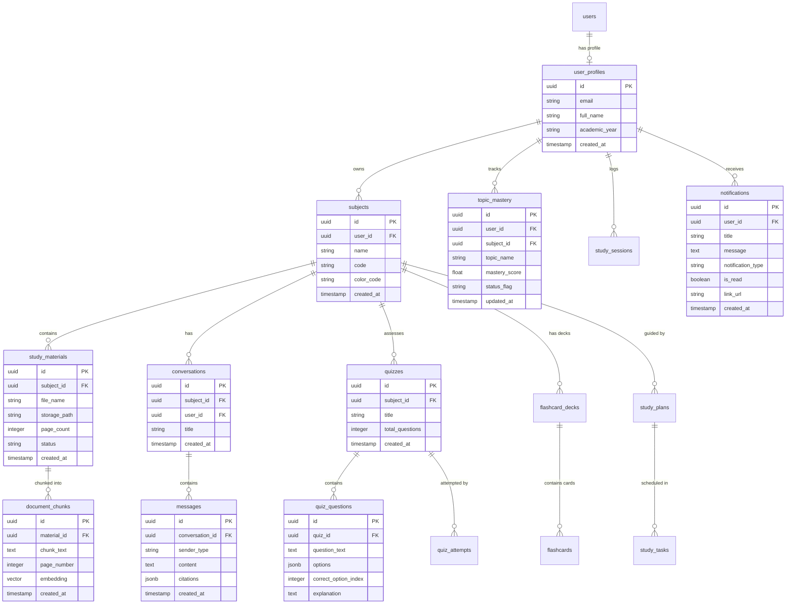

# DOCUMENT 03 — Database Schema & Entity Relationship Diagram (ERD)

## 1. Database Architecture
The database layer uses **PostgreSQL 16** with the **`pgvector`** extension enabled. This hybrid relational-vector design allows storing relational metadata (users, subjects, quizzes, sessions, notifications) alongside high-dimensional vector embeddings (`768`-dim vectors for text chunks generated by `gemini-embedding-001` configured with Matryoshka Representation Learning `output_dimensionality=768`) within a single database instance hosted on Supabase Free Tier.

---

## 2–3. Entity List & Traceability Mapping

| Entity Name | Table Name | Purpose / Description | Implemented Requirements |
|---|---|---|---|
| **User Profile** | `user_profiles` | Extended profile metadata linked to Supabase Auth UUID. | `FR-01` |
| **Subject** | `subjects` | Course/Subject container created by the student. | `FR-02` |
| **Study Material** | `study_materials` | Uploaded file record (PDF/Text) metadata. | `FR-03`, `FR-04` |
| **Document Chunk** | `document_chunks` | Parsed text chunk with 768-dim vector embedding. | `FR-04`, `AI-01`, `AI-02` |
| **Conversation** | `conversations` | Chat session container per subject. | `FR-05`, `FR-13` |
| **Message** | `messages` | Chat history messages with source citations. | `FR-05`, `AI-03`, `FR-14` |
| **Quiz** | `quizzes` | Generated quiz metadata and settings. | `FR-07`, `AI-04` |
| **Quiz Question** | `quiz_questions` | Individual MCQ questions, options, & answers. | `FR-07`, `AI-04` |
| **Quiz Attempt** | `quiz_attempts` | Student quiz attempt score and details. | `FR-07`, `FR-10` |
| **Flashcard Deck** | `flashcard_decks` | Flashcard collection container. | `FR-08`, `AI-05` |
| **Flashcard** | `flashcards` | Front/Back card pairs with review rating. | `FR-08`, `AI-05` |
| **Study Plan** | `study_plans` | AI-generated schedule for exam prep. | `FR-09`, `AI-07` |
| **Study Task** | `study_tasks` | Daily tasks within a study plan. | `FR-09`, `AI-07` |
| **Topic Mastery** | `topic_mastery` | Tracked mastery score per topic tag. | `FR-11`, `AI-08` |
| **Study Session** | `study_sessions` | Logged study duration and activity stream. | `FR-10`, `FR-15` |
| **Notification** | `notifications` | System alerts, study reminders, & read status. | `FR-16` |

---

## 4–12. Data Schema Details & Constraints
- **Primary Keys:** All tables use UUIDv4 (`gen_random_uuid()`) as primary keys.
- **Foreign Keys:** Cascading deletes (`ON DELETE CASCADE`) are configured for child entities (e.g., deleting a `subject` deletes associated `study_materials`, `quizzes`, and `conversations`).
- **Timestamps:** Every table contains `created_at TIMESTAMP WITH TIME ZONE DEFAULT NOW()` and `updated_at TIMESTAMP WITH TIME ZONE DEFAULT NOW()`.
- **Soft Delete:** `study_materials` and `subjects` include an optional `deleted_at TIMESTAMP WITH TIME ZONE` for soft-deletion capability.
- **Indexes:** Standard B-Tree indexes on foreign keys; **HNSW Index** (`vector_cosine_ops`) on `document_chunks.embedding` column for fast approximate nearest-neighbor vector search. Index on `notifications(user_id, is_read)` for quick unread alert retrieval.

---

## 13. Entity Relationship Diagram (Mermaid)



---

## 14. Executable PostgreSQL DDL Script

```sql
-- Enable pgvector extension
CREATE EXTENSION IF NOT EXISTS "uuid-ossp";
CREATE EXTENSION IF NOT EXISTS vector;

-- 1. USER PROFILES TABLE (FR-01)
CREATE TABLE user_profiles (
    id UUID PRIMARY KEY REFERENCES auth.users(id) ON DELETE CASCADE,
    email VARCHAR(255) NOT NULL UNIQUE,
    full_name VARCHAR(255),
    academic_year VARCHAR(50) DEFAULT '3rd Year CSE',
    created_at TIMESTAMP WITH TIME ZONE DEFAULT NOW(),
    updated_at TIMESTAMP WITH TIME ZONE DEFAULT NOW()
);

-- 2. SUBJECTS TABLE (FR-02)
CREATE TABLE subjects (
    id UUID PRIMARY KEY DEFAULT gen_random_uuid(),
    user_id UUID NOT NULL REFERENCES user_profiles(id) ON DELETE CASCADE,
    name VARCHAR(255) NOT NULL,
    code VARCHAR(50),
    color_code VARCHAR(20) DEFAULT '#4F46E5',
    created_at TIMESTAMP WITH TIME ZONE DEFAULT NOW(),
    updated_at TIMESTAMP WITH TIME ZONE DEFAULT NOW()
);

-- 3. STUDY MATERIALS TABLE (FR-03, FR-04)
CREATE TABLE study_materials (
    id UUID PRIMARY KEY DEFAULT gen_random_uuid(),
    subject_id UUID NOT NULL REFERENCES subjects(id) ON DELETE CASCADE,
    file_name VARCHAR(255) NOT NULL,
    storage_path TEXT NOT NULL,
    file_size_bytes INT NOT NULL,
    page_count INT DEFAULT 0,
    status VARCHAR(50) DEFAULT 'PENDING', -- PENDING, PROCESSING, COMPLETED, FAILED
    error_message TEXT,
    created_at TIMESTAMP WITH TIME ZONE DEFAULT NOW(),
    updated_at TIMESTAMP WITH TIME ZONE DEFAULT NOW()
);

-- 4. DOCUMENT CHUNKS TABLE (FR-04, AI-01, AI-02)
CREATE TABLE document_chunks (
    id UUID PRIMARY KEY DEFAULT gen_random_uuid(),
    material_id UUID NOT NULL REFERENCES study_materials(id) ON DELETE CASCADE,
    subject_id UUID NOT NULL REFERENCES subjects(id) ON DELETE CASCADE,
    chunk_index INT NOT NULL,
    chunk_text TEXT NOT NULL,
    page_number INT NOT NULL,
    embedding VECTOR(768), -- Google gemini-embedding-001 output dimension (MRL configured to 768)
    created_at TIMESTAMP WITH TIME ZONE DEFAULT NOW()
);

-- HNSW Vector Index for Cosine Similarity Search
CREATE INDEX idx_document_chunks_embedding 
ON document_chunks 
USING hnsw (embedding vector_cosine_ops)
WITH (m = 16, ef_construction = 64);

-- Index for subject filtering
CREATE INDEX idx_document_chunks_subject ON document_chunks(subject_id);

-- 5. CONVERSATIONS TABLE (FR-05)
CREATE TABLE conversations (
    id UUID PRIMARY KEY DEFAULT gen_random_uuid(),
    subject_id UUID NOT NULL REFERENCES subjects(id) ON DELETE CASCADE,
    user_id UUID NOT NULL REFERENCES user_profiles(id) ON DELETE CASCADE,
    title VARCHAR(255) DEFAULT 'New Study Session',
    created_at TIMESTAMP WITH TIME ZONE DEFAULT NOW()
);

-- 6. MESSAGES TABLE (FR-05, AI-03)
CREATE TABLE messages (
    id UUID PRIMARY KEY DEFAULT gen_random_uuid(),
    conversation_id UUID NOT NULL REFERENCES conversations(id) ON DELETE CASCADE,
    sender_type VARCHAR(20) NOT NULL, -- 'user' or 'assistant'
    content TEXT NOT NULL,
    citations JSONB DEFAULT '[]'::jsonb, -- Array of {material_id, file_name, page_number, snippet}
    created_at TIMESTAMP WITH TIME ZONE DEFAULT NOW()
);

-- 7. QUIZZES TABLE (FR-07, AI-04)
CREATE TABLE quizzes (
    id UUID PRIMARY KEY DEFAULT gen_random_uuid(),
    subject_id UUID NOT NULL REFERENCES subjects(id) ON DELETE CASCADE,
    title VARCHAR(255) NOT NULL,
    total_questions INT NOT NULL DEFAULT 5,
    created_at TIMESTAMP WITH TIME ZONE DEFAULT NOW()
);

-- 8. QUIZ QUESTIONS TABLE (FR-07, AI-04)
CREATE TABLE quiz_questions (
    id UUID PRIMARY KEY DEFAULT gen_random_uuid(),
    quiz_id UUID NOT NULL REFERENCES quizzes(id) ON DELETE CASCADE,
    question_text TEXT NOT NULL,
    options JSONB NOT NULL, -- ["Option A", "Option B", "Option C", "Option D"]
    correct_option_index INT NOT NULL,
    explanation TEXT NOT NULL,
    topic_tag VARCHAR(100) DEFAULT 'General'
);

-- 9. QUIZ ATTEMPTS TABLE (FR-07, FR-10)
CREATE TABLE quiz_attempts (
    id UUID PRIMARY KEY DEFAULT gen_random_uuid(),
    quiz_id UUID NOT NULL REFERENCES quizzes(id) ON DELETE CASCADE,
    user_id UUID NOT NULL REFERENCES user_profiles(id) ON DELETE CASCADE,
    score_achieved INT NOT NULL,
    total_score INT NOT NULL,
    percentage_score FLOAT NOT NULL,
    user_answers JSONB NOT NULL,
    created_at TIMESTAMP WITH TIME ZONE DEFAULT NOW()
);

-- 10. FLASHCARD DECKS TABLE (FR-08, AI-05)
CREATE TABLE flashcard_decks (
    id UUID PRIMARY KEY DEFAULT gen_random_uuid(),
    subject_id UUID NOT NULL REFERENCES subjects(id) ON DELETE CASCADE,
    title VARCHAR(255) NOT NULL,
    card_count INT DEFAULT 0,
    created_at TIMESTAMP WITH TIME ZONE DEFAULT NOW()
);

-- 11. FLASHCARDS TABLE (FR-08, AI-05)
CREATE TABLE flashcards (
    id UUID PRIMARY KEY DEFAULT gen_random_uuid(),
    deck_id UUID NOT NULL REFERENCES flashcard_decks(id) ON DELETE CASCADE,
    front_text TEXT NOT NULL,
    back_text TEXT NOT NULL,
    difficulty_rating VARCHAR(20) DEFAULT 'MEDIUM', -- EASY, MEDIUM, HARD
    last_reviewed_at TIMESTAMP WITH TIME ZONE
);

-- 12. STUDY PLANS TABLE (FR-09, AI-07)
CREATE TABLE study_plans (
    id UUID PRIMARY KEY DEFAULT gen_random_uuid(),
    subject_id UUID NOT NULL REFERENCES subjects(id) ON DELETE CASCADE,
    user_id UUID NOT NULL REFERENCES user_profiles(id) ON DELETE CASCADE,
    exam_name VARCHAR(255) NOT NULL,
    target_exam_date DATE NOT NULL,
    daily_hours_allocated FLOAT DEFAULT 2.0,
    status VARCHAR(50) DEFAULT 'ACTIVE',
    created_at TIMESTAMP WITH TIME ZONE DEFAULT NOW()
);

-- 13. STUDY TASKS TABLE (FR-09, AI-07)
CREATE TABLE study_tasks (
    id UUID PRIMARY KEY DEFAULT gen_random_uuid(),
    plan_id UUID NOT NULL REFERENCES study_plans(id) ON DELETE CASCADE,
    scheduled_date DATE NOT NULL,
    topic_title VARCHAR(255) NOT NULL,
    task_description TEXT,
    is_completed BOOLEAN DEFAULT FALSE,
    created_at TIMESTAMP WITH TIME ZONE DEFAULT NOW()
);

-- 14. TOPIC MASTERY TABLE (FR-11, AI-08)
CREATE TABLE topic_mastery (
    id UUID PRIMARY KEY DEFAULT gen_random_uuid(),
    user_id UUID NOT NULL REFERENCES user_profiles(id) ON DELETE CASCADE,
    subject_id UUID NOT NULL REFERENCES subjects(id) ON DELETE CASCADE,
    topic_name VARCHAR(255) NOT NULL,
    mastery_score FLOAT NOT NULL DEFAULT 0.5, -- Range 0.0 to 1.0
    status_flag VARCHAR(20) DEFAULT 'NEUTRAL', -- WEAK (<0.6), NEUTRAL, MASTERED (>=0.8)
    updated_at TIMESTAMP WITH TIME ZONE DEFAULT NOW(),
    UNIQUE(user_id, subject_id, topic_name)
);

-- 15. STUDY SESSIONS TABLE (FR-10, FR-15)
CREATE TABLE study_sessions (
    id UUID PRIMARY KEY DEFAULT gen_random_uuid(),
    user_id UUID NOT NULL REFERENCES user_profiles(id) ON DELETE CASCADE,
    subject_id UUID REFERENCES subjects(id) ON DELETE SET NULL,
    duration_minutes INT NOT NULL,
    activity_type VARCHAR(50) NOT NULL, -- 'RAG_CHAT', 'QUIZ', 'FLASHCARDS', 'SUMMARY'
    created_at TIMESTAMP WITH TIME ZONE DEFAULT NOW()
);

-- 16. NOTIFICATIONS TABLE (FR-16)
CREATE TABLE notifications (
    id UUID PRIMARY KEY DEFAULT gen_random_uuid(),
    user_id UUID NOT NULL REFERENCES user_profiles(id) ON DELETE CASCADE,
    title VARCHAR(255) NOT NULL,
    message TEXT NOT NULL,
    notification_type VARCHAR(50) DEFAULT 'REMINDER', -- REMINDER, WEAK_TOPIC_ALERT, SYSTEM
    is_read BOOLEAN DEFAULT FALSE,
    link_url TEXT,
    created_at TIMESTAMP WITH TIME ZONE DEFAULT NOW()
);

CREATE INDEX idx_notifications_user_read ON notifications(user_id, is_read);
```
